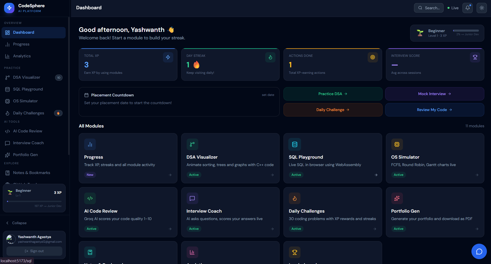
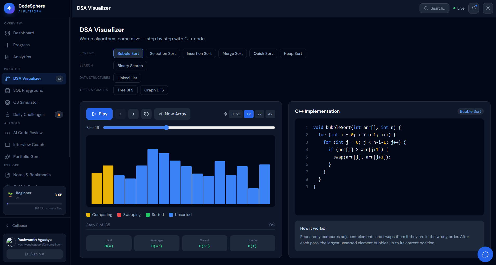
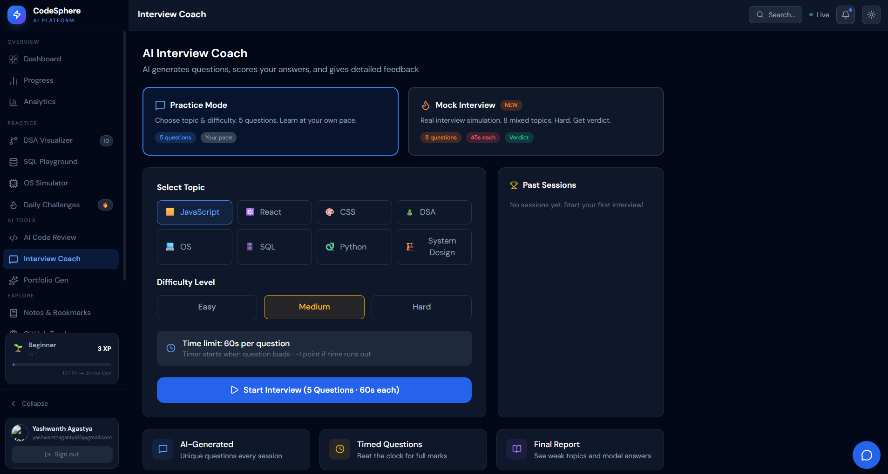
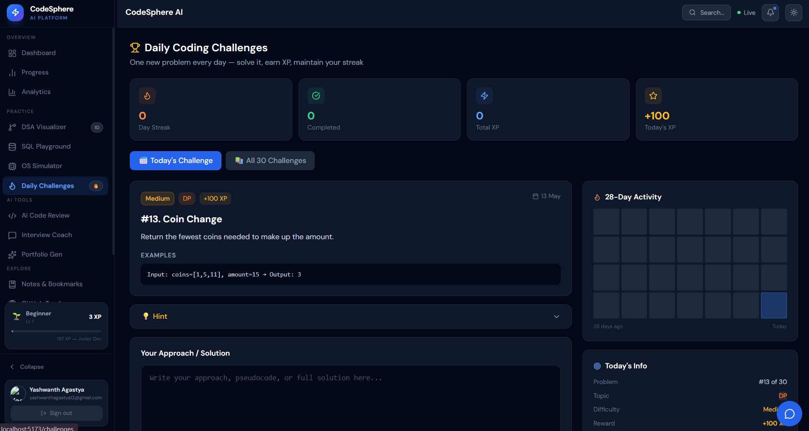

# CodeSphere AI 🚀

<div align="center">


**Your AI-Powered Developer Productivity Platform for Campus Placements**

[](https://reactjs.org)
[](https://python.org)
[](https://flask.palletsprojects.com)
[](https://firebase.google.com)
[](https://tailwindcss.com)
[](https://groq.com)
[](https://vitejs.dev)
[](LICENSE)

[🔗 Live Demo](#) · [📁 GitHub Repo](https://github.com/YashwanthaY/Codesphere-AI) · [🐛 Report Bug](https://github.com/YashwanthaY/Codesphere-AI/issues)

</div>
## 📸 Screenshots

| Dashboard | DSA Visualizer |
|-----------|---------------|
|  |  |

| Interview Coach | Daily Challenges |
|----------------|-----------------|
|  |  |
---

## 📌 Problem Statement

Engineering students preparing for campus placements juggle DSA on one platform, SQL on another, OS concepts in textbooks, and mock interviews on expensive paid services. There is no single free platform that covers the full placement preparation cycle with AI assistance.

**CodeSphere AI solves this** — it combines **14 powerful modules** into one cohesive, AI-integrated web application, completely free and open source.

---

## ✨ Features — 14 Modules

### 🏠 1. Dashboard
- Placement countdown timer
- XP progress bar with level display (Beginner → Expert)
- Module explorer with quick navigation
- Recent activity feed

### 📈 2. Progress Dashboard
- XP history chart (Recharts)
- Module visit activity heatmap
- DSA problem completion grid
- Interview attempt history

### 🌲 3. DSA Visualizer
- 10 algorithms animated: Bubble Sort, Selection Sort, Insertion Sort, Merge Sort, Quick Sort, Binary Search, Linear Search, Stack, Queue, Linked List
- Step-by-step animation with Play / Pause / Reset / Speed controls
- C++ code panel alongside each animation
- Color-coded states: comparing (yellow), swapping (red), sorted (green)
- Time & Space complexity shown per algorithm

### 🗄️ 4. SQL Playground
- Real SQLite running in-browser via **WebAssembly (sql.js)** — no server needed
- Preloaded sample databases for practice
- Live query execution with results table
- Toggle to visualize results as bar/pie charts (Recharts)
- DBMS concept reference cards

### ⚙️ 5. OS Simulator
- CPU Scheduling algorithms: FCFS, SJF, Priority, Round Robin (configurable quantum)
- Animated Gantt chart with hover tooltips
- Calculates average waiting time & turnaround time
- Memory Management: Fixed vs Dynamic partitioning visual
- Page Replacement: FIFO and LRU simulation with hit/miss tracking

### 🤖 6. AI Code Reviewer
- Paste code in Python, JavaScript, C++, Java, TypeScript, or SQL
- Powered by **Groq AI (LLaMA 3.3-70B)** for fast responses
- Three separate actions: **Run**, **Explain**, **Review** with independent loading states
- Review returns: bug list, quality score (1–10), improvement suggestions, refactored code
- Severity classification: High / Medium / Low

### 📊 7. Analytics Dashboard
- Connect any public GitHub username
- KPI cards: repositories, stars, forks, followers
- Language breakdown: bar chart + pie chart
- Top repositories by stars
- Recent contribution activity feed

### 🎤 8. Interview Coach
- Two modes: **Practice** (no timer) and **Mock Interview** (timed)
- AI generates unique questions per topic and difficulty
- Topics: JavaScript, React, CSS, DSA, OS, SQL, Python, System Design
- Difficulty: Easy / Medium / Hard with auto-adjusted countdown timer
- AI evaluates each answer → score + detailed feedback
- Final verdict: **HIRED ✅** or **REJECTED ❌**
- Full session report with weak topic identification

### 🌐 9. Portfolio Generator
- Fill a form: name, bio, skills, projects, education, experience
- Multiple color themes to choose from
- Live preview mode
- Download as a ready-to-host **HTML file**
- Export as **PDF**

### 🏆 10. Leaderboard
- Real-time Firebase leaderboard across all registered users
- Ranked by XP with level badges
- Updates automatically when users earn XP

### 🔥 11. Daily Challenges
- 30 curated DSA/concept problems
- XP rewards on completion
- Streak tracking — builds daily habit
- Submit answers with instant feedback

### 🐙 12. GitHub Activity Tracker
- Visualize any user's GitHub contribution graph
- Repository stats and language usage
- Fetch live data via GitHub REST API

### 🏅 13. Achievements
- 30 unlockable badges across 6 categories
- Tracks milestones: first login, XP thresholds, module completions, streaks
- Visual badge gallery with unlock conditions

### 📝 14. Notes & Bookmarks
- Create text notes and code-snippet notes
- Tag, pin, and search notes
- Bookmark important resources
- All data persisted per user in Firebase Firestore

---

## 🎮 XP & Level System

| Level | Name | XP Required |
|-------|------|-------------|
| 1 | Beginner | 0 XP |
| 2 | Junior Developer | 200 XP |
| 3 | Mid Developer | 500 XP |
| 4 | Senior Developer | 1000 XP |
| 5 | Expert | 2000 XP |

Earn XP by solving daily challenges, completing code reviews, finishing mock interviews, practicing DSA, and more.

---

## 🛠️ Tech Stack

| Category | Technology |
|----------|-----------|
| **Frontend** | React.js 18, Vite, Tailwind CSS, React Router DOM |
| **State Management** | React Context API (Auth, XP, Toast), localStorage |
| **Backend** | Python 3.x, Flask, Flask-CORS, python-dotenv |
| **AI Engine** | Groq AI — LLaMA 3.3-70B Versatile (fast inference) |
| **Authentication** | Firebase Authentication (Google OAuth) |
| **Database** | Firebase Firestore (per-user cloud storage) |
| **In-Browser DB** | SQLite via WebAssembly (sql.js) |
| **Charts** | Recharts |
| **Icons** | Lucide React |
| **External APIs** | GitHub REST API (public, no auth required) |
| **Deployment** | Vercel (frontend) + Render (backend) |

---

## 📁 Project Structure

```
codesphere-ai/
├── src/
│   ├── components/
│   │   ├── layout/
│   │   │   ├── Sidebar.jsx          # Grouped nav, XP bar, dark slate theme
│   │   │   └── BottomNav.jsx        # Mobile bottom nav (5 items)
│   │   └── AIChatAssistant.jsx      # Floating AI chat bubble (Groq powered)
│   ├── context/
│   │   ├── AuthContext.jsx          # Firebase auth state
│   │   ├── XPContext.jsx            # XP + level system
│   │   └── ToastContext.jsx         # Global toast notifications
│   ├── pages/
│   │   ├── Dashboard.jsx            # Home — countdown, XP, module explorer
│   │   ├── ProgressDashboard.jsx    # XP chart, heatmap, DSA grid
│   │   ├── DSAVisualizer.jsx        # 10 algorithm animations
│   │   ├── SQLPlayground.jsx        # WebAssembly SQLite editor
│   │   ├── OSSimulator.jsx          # CPU scheduling + memory sim
│   │   ├── AICodeReviewer.jsx       # Groq-powered code review
│   │   ├── AnalyticsDashboard.jsx   # GitHub analytics
│   │   ├── InterviewCoach.jsx       # AI mock interviews
│   │   ├── PortfolioGenerator.jsx   # HTML + PDF portfolio
│   │   ├── Leaderboard.jsx          # Firebase live leaderboard
│   │   ├── DailyChallenges.jsx      # 30 problems, XP, streaks
│   │   ├── GitHubTracker.jsx        # GitHub activity tracker
│   │   ├── Achievements.jsx         # 30 badges, 6 categories
│   │   ├── NotesBookmarks.jsx       # Notes + bookmarks manager
│   │   └── Login.jsx                # Google sign-in page
│   ├── utils/
│   │   └── progressTracker.js       # Module visit + activity tracking
│   ├── config/
│   │   └── firebase.js              # Firebase project config
│   └── App.jsx                      # All 14 routes registered
├── backend/
│   ├── app.py                       # Flask server + all routes
│   ├── requirements.txt
│   └── render.yaml                  # Render deployment config
├── vercel.json                      # Vercel deployment config
├── .env.development                 # VITE_API_URL=http://localhost:5000
├── .env.production                  # VITE_API_URL=<render-url>
└── README.md
```

---

## 🚀 Getting Started (Local Setup)

### Prerequisites

- Node.js 18+
- Python 3.9+
- Git
- [Firebase account](https://console.firebase.google.com) (free)
- [Groq API key](https://console.groq.com) (free)

### 1. Clone the Repository

```bash
git clone https://github.com/YashwanthaY/Codesphere-AI.git
cd Codesphere-AI
```

### 2. Frontend Setup

```bash
# Install dependencies
npm install

# Create development env file (already in repo)
# .env.development contains: VITE_API_URL=http://localhost:5000

# Start development server
npm run dev
# Runs on http://localhost:5173
```

### 3. Backend Setup

```bash
cd backend

# Create and activate virtual environment
python -m venv venv

# Windows
venv\Scripts\activate

# Mac / Linux
source venv/bin/activate

# Install dependencies
pip install -r requirements.txt

# Create .env file
echo "GROQ_API_KEY=your_groq_api_key_here" > .env

# Start Flask server
python app.py
# Runs on http://localhost:5000
```

### 4. Firebase Setup

1. Go to [Firebase Console](https://console.firebase.google.com) → Create project
2. Enable **Google Authentication** (Auth → Sign-in method)
3. Enable **Firestore Database** (start in test mode)
4. Go to Project Settings → Your apps → Add web app
5. Copy the config object into `src/config/firebase.js`
6. Add `localhost` to **Authorized domains** (Auth → Settings)

### 5. Environment Variables

**`backend/.env`**
```
GROQ_API_KEY=your_groq_api_key_here
```

Get your free Groq API key at: https://console.groq.com

---

## 🌐 Deployment

### Backend → Render (Free Tier)

1. Go to [render.com](https://render.com) → New Web Service
2. Connect your GitHub repository
3. Set **Root Directory**: `backend`
4. **Build Command**: `pip install -r requirements.txt`
5. **Start Command**: `gunicorn app:app`
6. Add environment variable: `GROQ_API_KEY = <your key>`
7. Deploy → copy your URL (e.g. `https://codesphere-ai-backend.onrender.com`)

### Frontend → Vercel (Free Tier)

1. Go to [vercel.com](https://vercel.com) → New Project → Import GitHub repo
2. Framework preset: **Vite**
3. Add environment variable: `VITE_API_URL = <your Render URL>`
4. Deploy → copy your URL (e.g. `https://codesphere-ai.vercel.app`)

### Post-Deployment Steps

1. **Firebase Authorized Domains**: Firebase Console → Auth → Settings → Add your Vercel URL
2. **Backend CORS**: Update `app.py` with your real Vercel URL → redeploy Render

---

## 🔌 Backend API Routes

| Method | Route | Description |
|--------|-------|-------------|
| POST | `/api/review` | AI code review (Groq) |
| POST | `/api/execute` | Code explanation request |
| POST | `/api/explain` | Detailed code explanation |
| POST | `/api/chat` | AI chat assistant |
| POST | `/api/interview/question` | Generate interview question |
| POST | `/api/interview/evaluate` | Evaluate interview answer |

---

## 💡 Key Skills Demonstrated

| Skill | Implementation |
|-------|---------------|
| React.js + Hooks | useState, useEffect, useCallback, useRef, custom hooks |
| React Context API | Three global contexts: Auth, XP/Level, Toast notifications |
| Firebase | Google OAuth, Firestore real-time per-user data |
| Python Flask | REST API with 6 endpoints, CORS, error handling |
| Groq AI Integration | LLaMA 3.3-70B with prompt engineering |
| WebAssembly | SQLite running in-browser via sql.js |
| Data Visualization | Recharts — line, bar, pie, heatmap charts |
| Algorithm Visualization | 10 animated DSA algorithms with step-by-step playback |
| OS Concepts | FCFS, SJF, Priority, Round Robin, LRU Page Replacement |
| Responsive Design | Mobile-first with Tailwind CSS + custom BottomNav |
| State Persistence | Firebase Firestore + localStorage hybrid |
| Deployment | Vercel + Render with CI/CD via GitHub |

---

## 🔮 Future Improvements

- Monaco Editor for in-browser code editing
- Real-time collaborative coding (WebSockets)
- Company-specific interview question tracks (Amazon, Google, etc.)
- Mobile app (React Native)
- Email-based progress reports (SendGrid)
- More DSA: Graphs (BFS/DFS), Trees, Dynamic Programming visualizations

---

## 👨‍💻 Author

**Yashwantha Y**

- 🎓 Final Year B.Tech CSE (AI & ML) Student
- 📍 Karnataka, India
- 🔗 GitHub: [@YashwanthaY](https://github.com/YashwanthaY)
- 💼 LinkedIn: [Add your LinkedIn URL]
- 📧 Email: yashwanthagastya12@gmail.com

---

## 📄 License

This project is open source and available under the [MIT License](LICENSE).

---

<div align="center">

**⭐ Star this repo if you found it helpful!**

Built with ❤️ using React.js · Python Flask · Groq AI · Firebase · Tailwind CSS

</div>